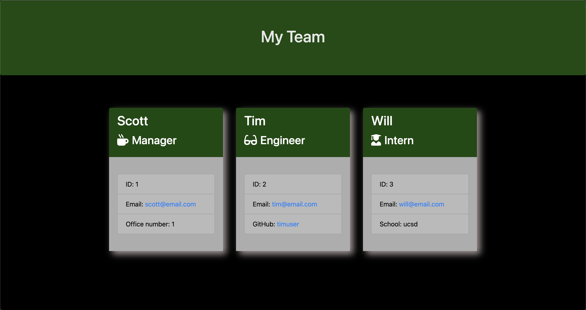

# Write em Down

[](http://unlicense.org/)

## Description

My motivation for this app was to build something for users that want to orgainze and view their teams. I built this to test my skills with inquire. In this app you can add managers, engineers, interns, and employees. Add personal information to each role and it will display a card in the index.html.

## Table of Contents

- [Installation](#installation)
- [Usage](#usage)
- [Contributing](#contributing)
- [Tests](#tests)
- [Questions](#questions)

### Installation

To install necessary dependencies, run the following command:

```md
    npm init -y
    npm i
```

### Usage

Run the following command to start the app.

```md
node index.js
```

After completing the questions open the index.html in your browser to view your team.

### Contributing

If you would like to contribute please fork from the repo and submit a pull request.

### Tests

To run tests, run the following command:

```md
    npm test
```

### Questions

If you have any questions please reach out via Github, my username is jessemarino.


